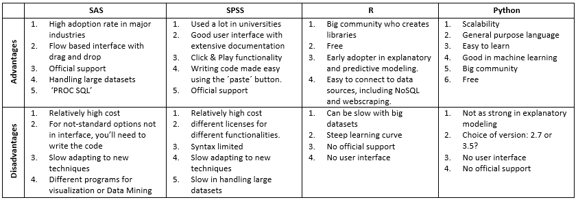

# A tour of Python

### Agenda 

- why Python? 
- tour of Jupyter
- tour of pandas (dataframes)
- sklearn example
- fastai example

### Why should you use python? 

- fastest growing language
- scalability of computation (advantage over R)
- wide variety of packages and apps
- main language for deep learning
- Jupyter notebook and Jupyter lab have become as good as RStudio

### Tour of Jupyter

- cells - code and markdown
- extensions (e.g. collapsable headings)
- exporting as html or code
- support for grading students - e.g. teaching a class

### Tour of pandas and sklearn

- create a dataframe
- load a dataframe
- do manipulation on dates
- plot some results
- do machine learning example

### Comparison between R and Python

| R | Python |
|---|----|
| RStudio | Jupyter lab |
| knittr | export notebook as html |
| caret  | sklearn |
| dataframe | dataframe |
| ggplot | matplotlib; seaborn |

### Examples of different packages

- scipy for statistics/engineering - https://docs.scipy.org/doc/scipy-1.1.0/reference/
- networkx for graphs - https://networkx.github.io/
- twint for Twitter scraping - https://github.com/twintproject
- biopython - https://biopython.org/ 
- most important for data science: 
  - pandas - dataframes
  - numpy - numerical array manipulations
  - matplotlib - visualization 
  - scikit-learn - machine learning - linear, logistic, random forest, clustering... 
  - keras, tensorflow, openai - deep learning, reinforcement learning
  - fastai - deep learning done better

### Examples of usecases

- simple data analysis - e.g. cluster utilization data
- twitter scraping of election tweets - natural language processing
- funding network of NSF and NIH - using networkx - examples - work in progress
- a book learning python - Python for Data Science
- a course taught with Jupyter notebooks - Computational Genetics - grading included
- variable importances  
- transfer learning in deep learning

### Resources

- software carpentries (easy) [link](https://software-carpentry.org/lessons/)
- exercism.io   (easy) [link](https://exercism.io/tracks/python)
- kaggle kernels (medium) [link](https://www.kaggle.com/kernels)
- fastai courses (advanced) [link](https://www.fast.ai/)
- a gallery of Jupyter notebooks [link](https://github.com/jupyter/jupyter/wiki/A-gallery-of-interesting-Jupyter-Notebooks)

